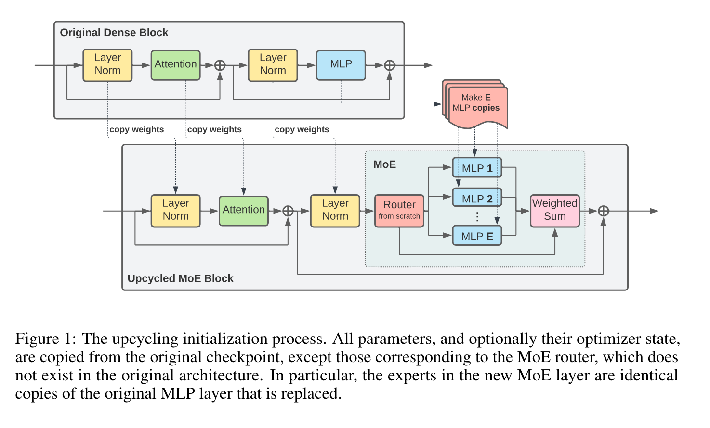

# MoE-based Model Model Upscaling (Sparse Upcycling)

<figure markdown="span">
    {width="900"}
</figure>

Sparse upcycling is a technique used to initialize a sparsely activated Mixture-of-Experts (MoE) model from a dense checkpoint. This approach leverages previously incurred training costs to improve the performance of large models while reducing the computational expense. In the process, dense Transformer blocks are partially replaced with MoE blocks, where the MLPs in a Transformer block are replaced by multiple experts. The experts are chosen based on routing probabilities determined by a router. The initialized MoE model is then further trained to recover the performance. This method results in improved performance for both language and vision models while using only a fraction of the original dense pretraining cost [^1].

## Examples

Here’s an example demonstrating how to upscale a pre-trained Mistral model to a Mixtral model:

```python
import os

from omegaconf import DictConfig
from transformers import MistralForCausalLM

from fusion_bench.method.mixture_of_experts.mixtral_upcycling import (
    MixtralForCausalLMUpscalingAlgorithm,
)
from fusion_bench.utils import print_parameters

# Load a pre-trained Mistral model
pretrained_model = MistralForCausalLM.from_pretrained(
    os.path.expanduser("path_to_mistral_model")
)
print("Pretrained model:")
print_parameters(pretrained_model)
# Output:
# Pretrained model:
# trainable params: 7.24B || all params: 7.24B || trainable%: 100.0000

# Define the configuration for Mixtral
config = {
    "num_experts": 4,  # Number of expert channels
    "experts_per_token": 2,  # Experts to choose per token
}

# Initialize the upscaling algorithm
upscaling_for_causal_lm_algorithm = MixtralForCausalLMUpscalingAlgorithm(
    DictConfig(config)
)

# Run the upscaling process to get a Mixtral model
mixtral_for_causal_lm_model = upscaling_for_causal_lm_algorithm.run(pretrained_model)

print("Mixtral model:")
print_parameters(mixtral_for_causal_lm_model)
# Outputs:
# Mixtral model:
# trainable params: 24.15B || all params: 24.15B || trainable%: 100.0000

# Save the upscaled Mixtral model
mixtral_for_causal_lm_model.save_pretrained("path_to_save_mixtral_model")
```

## Code Integration

This is a guide on how to use the `fusion_bench` command-line interface to upscale a Mistral model to a Mixtral model.

The first code block is a YAML configuration file for the upscaling method. The name field specifies the name of the upscaling method. The `num_experts` field specifies the number of experts to use in the upscaling process. The `experts_per_token` field specifies the number of experts to use per token. The `save_checkpoint` field specifies the path where the upscaled model will be saved, if provided.


```yaml title="config/method/mixtral_moe_upscaling.yaml"
name: mixtral_for_causal_lm_moe_upscaling # or "mixtral_moe_upscaling"

num_experts: 4
experts_per_token: 2
# path to save the upscaled model
save_checkpoint: null

```

The second code block is another YAML configuration file, this time for the model pool. The `type` field specifies the type of model pool to use. The `models` field is a list of models to include in the pool. Each model should have a `name` and a `path`, and the model is loaded from the `path`.

```yaml title="config/modelpool/mixtral_moe_upscaling.yaml"
type: AutoModelForCausalLMPool
# each model should have a name and a path, and the model is loaded from the path
# this is equivalent to `AutoModelForCausalLM.from_pretrained(path)`
models:
  - name: _pretrained_
    path: path_to_your_pretrained_model
```

Finally, the third code block is a bash command that runs the fusion_bench command-line interface with the specified method, model pool, and task pool. The method argument specifies the upscaling method to use. The modelpool argument specifies the model pool to use. The modelpool.models.0.path argument specifies the path to the pretrained model to use. The taskpool argument specifies the task pool to use. In this case, a dummy task pool is used that does nothing but print the parameter counts of the merged model.

```bash
fusion_bench \
    method=mixtral_moe_upscaling \
    modelpool=mixtral_moe_upscaling \
        modelpool.models.0.path=path_to_your_pretrained_model \
    taskpool=dummy # this is a dummy taskpool that does nothing but print the parameter counts of the merged model
```

## References

::: fusion_bench.method.mixture_of_experts.mixtral_upcycling


[^1]: Sparse Upcycling: Training Mixture-of-Experts from Dense Checkpoints. http://arxiv.org/abs/2212.05055
