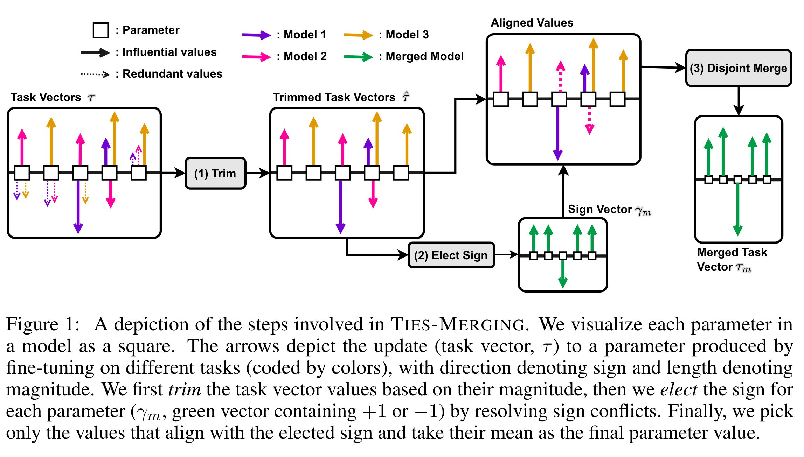

# Ties Merging

<figure markdown="span">
  { width="750" }
  <figcaption>Ties-Merging. Credit to <sup id="fnref:1"><a class="footnote-ref" href="#fn:1">1</a></sup></figcaption>
</figure>

Ties-Merging[^1] represents a novel and structured approach to consolidating multiple task-specific models into a single, efficient multi-task model. This method employs a sequence of deliberate steps to systematically merge task vectors, ensuring that the final model effectively integrates the strengths of each individual task-specific model and resolves potential conflicts between them.

The Ties-Merging algorithm operates through three primary steps:

1. Trim: This initial step involves refining the task-specific models by trimming unnecessary parameters, focusing the model on essential elements for each task.
2. Elect Sign of Parameters: In this step, the algorithm selects the appropriate signs for the parameters, ensuring that the integrated model parameters are optimally oriented for multi-task learning.
3. Disjoint Merge: Finally, the method performs a disjoint merge to combine the task-specific parameters into a single cohesive task vector, denoted as $\tau$.

Given the final merged task vector $\tau$, the ultimate model is determined similarly to the method used in task arithmetic. The formulation is expressed as:

$$
\theta = \theta_0 + \lambda \tau
$$

where $\lambda$ is a hyperparameter chosen based on the validation set to ensure the best-performing model.

By following these structured steps, Ties-Merging effectively integrates multiple task-specific models into a unified multi-task model, balancing the contributions of each task to enhance overall performance. The process ensures that the final model retains the benefits of the pre-trained model while optimally incorporating the diverse knowledge contained within the individual task-specific models.

## Code Integration

Configuration template for the Ties-Merging algorithm:

```yaml title="config/method/ties_merging.yaml"
name: ties_merging
# Scaling factor $\lambda$
scaling_factor: 0.5
threshold: 0.5
# List of keys to remove from the state dict, default is empty
remove_keys: []
# Function to merge the models, default is sum. Options are 'sum', 'mean', and 'max'
merge_func: sum 
```

Use the following command to run the Ties-Merging algorithm:

```bash
fusion_bench method=ties_merging ...
```

::: fusion_bench.method.TiesMergingAlgorithm
    options:
        members: true


[^1]: (NIPS 2023) Resolving Interference When Merging Models. http://arxiv.org/abs/2306.01708
